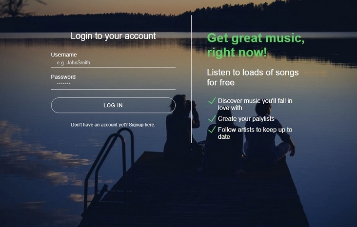
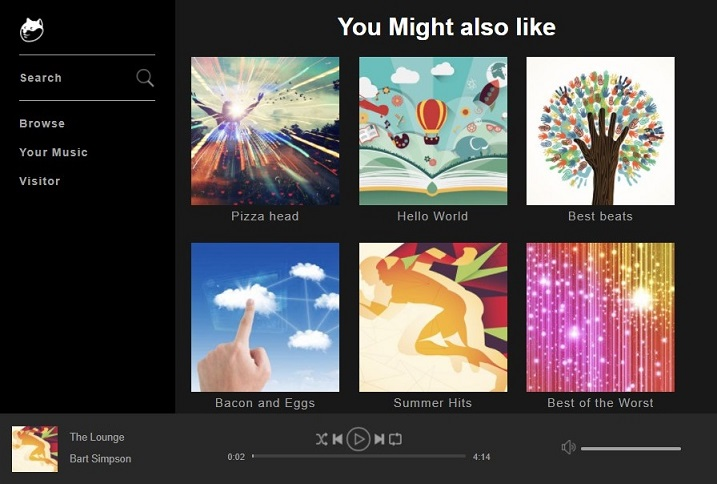
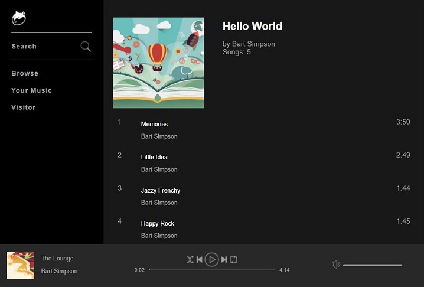
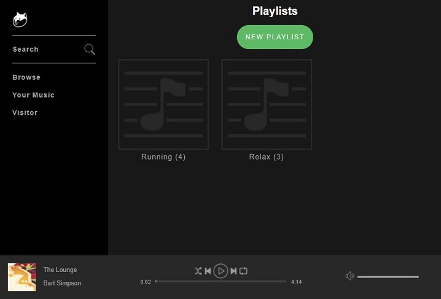
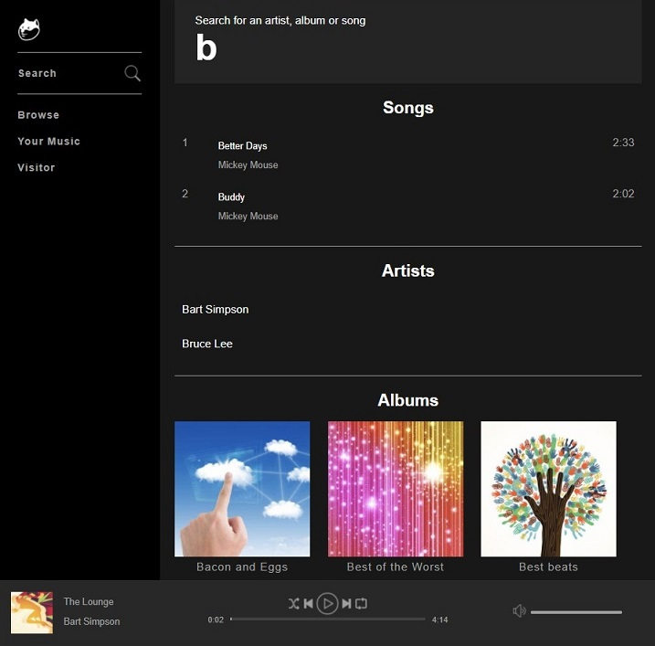
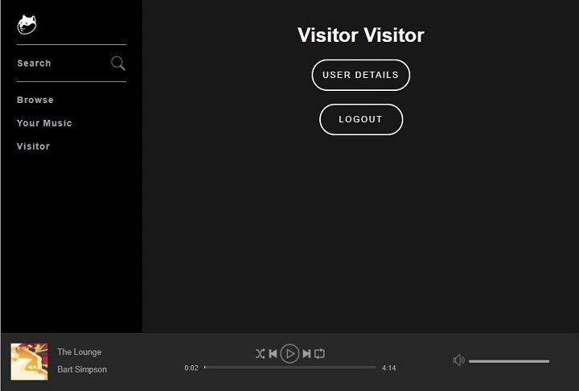

# musicify
#### Spotify Clone

Created while Learning object oriented programming PHP + MySQL with some Ajax, JavaScript, jQuerry and CSS.

#### Main features:
- Music player (play, pause, shuffle, repeat, adjust volume...)
- Search for songs, artists and albums
- Create/delete playlists
- Add/remove songs from playlists
- Seamless transition between pages

Login page:

Main view:

Song list of selected album:

User's playlists:

Search results when search term is 'b':

User's settings page:

Based on lessons from [Reece Kenney](https://www.udemy.com/user/reecekenney).

Project uses public domain music (copyright free).
